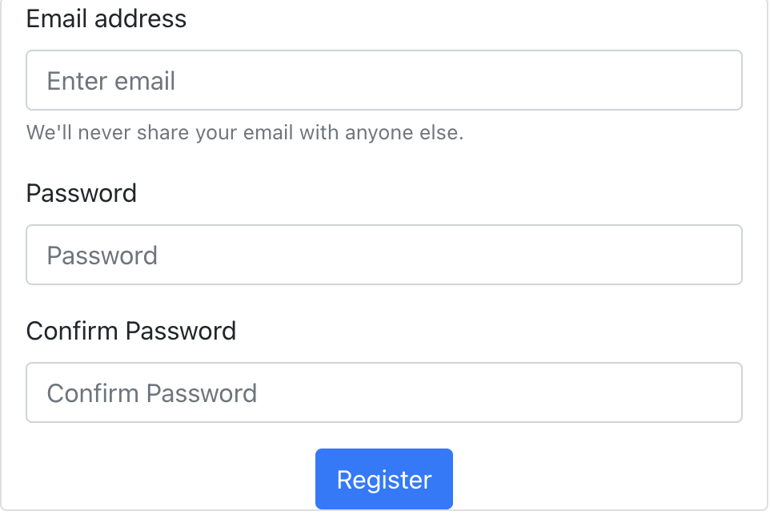

  <h1>React Components</h1>

  A sandbox for me to experiment with React componenents. Some I built myself, some are open source, and some are open source with modifications. For the most part, these are functional components that operate using React Hooks as state management functions.

<h2>/Components/src/components => </h2>

  <h3>Collapsible Side Navigation bar</h3>
  
This component features a top bar with a logo and general navigation links and a panel that slides out from the left side of the screen on click. To close the panel, simply click anywhere outside the panel. The toggle to open the panel is located in the top left corner of the viewport.

  <h3>Registration/Login Form</h3>
  
This form is a dual use reg/login form. The input fields are email/pw1/pwCheck. All inputs are pre-hooked to set individual state properties to their correct values. To complete form, add 'submit' hooks to register in database or issue login credentials.

  </img>

  <h3>Parallax-ish Landing Page</h3>
  
This landing page was built based off of this tutorial: https://hungryturtlecode.com/demos/parallaxbasic/ . This is a single component that is made up of 3 distinct views, making the total height at least 3x viewport. Two breakpoints are set and utilized to switch from first to second and second to third views. Transitions include zoom, slide out left, slide out up. Also included in this repo is the code for 'handwriting' your name across the screen.

